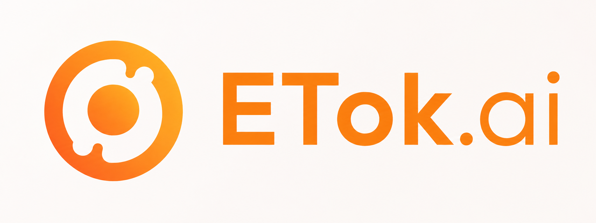
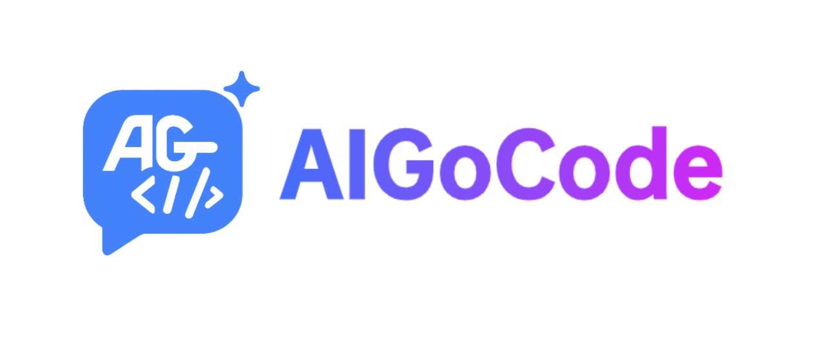
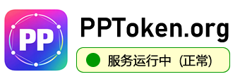
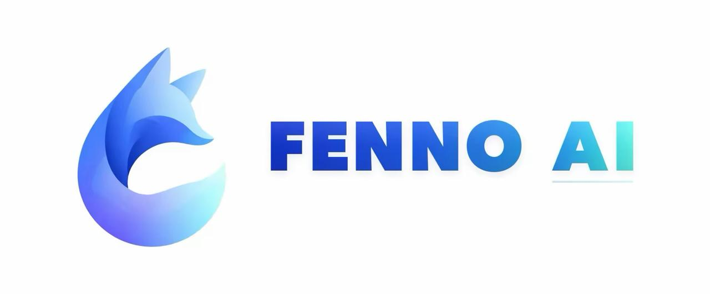
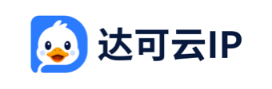

<div align="center">


# Sub2API

[](https://golang.org/)
[](https://vuejs.org/)
[](https://www.postgresql.org/)
[](https://redis.io/)
[](https://www.docker.com/)

<a href="https://trendshift.io/repositories/21823" target="_blank"></a>

**AI API Gateway Platform for Subscription Quota Distribution**

English | [中文](README_CN.md) | [日本語](README_JA.md)

</div>

## ⚠️ Important Notice

Please read the following carefully before using this project:

- **🚨 Terms of Service Risk**: Using this project may violate the terms of service of Anthropic and other upstream providers. Please review the relevant providers' user agreements before use; all risks arising from such use are borne solely by the user.
- **⚖️ Compliant Use**: Use this project only in compliance with the laws and regulations of your country or region. Any unlawful use is strictly prohibited.
- **📖 Disclaimer**: This project is provided for technical learning and research purposes only. The authors assume no liability for account bans, service interruptions, data loss, or any other direct or indirect damages resulting from the use of this project.
- **🚫 No Commercial Authorization**: The developers of this project have never authorized any individual or organization to conduct any form of commercial operation based on this project. Any commercial activity conducted in the name of or based on this project is unrelated to this project and its developers, and all resulting disputes, losses, and legal liabilities shall be borne solely by the party conducting such activity.

## ❤️ Sponsors

> [Want to appear here?](mailto:support@sub2api.org)

<table>

<tr>
<td width="180"><a href="https://cctk.ai/register?aff=SUB2API"></a></td>
<td>Thanks to CCTK.AI for sponsoring this project! <a href="https://cctk.ai/register?aff=SUB2API">CCTK.AI</a> is an AI API gateway focused on stability and cost-effectiveness, offering fast relay services for Claude, OpenAI, Gemini, and other popular models. It works seamlessly with Claude Code, Codex, and other mainstream coding tools, delivering the same model capabilities at a fraction of the official cost. Register via <a href="https://cctk.ai/register?aff=SUB2API">this link</a> for faster, more stable, and more affordable AI API access.</td>
</tr>

<tr>
<td width="180"><a href="https://www.openmodel.ai?ref=sub2api"></a></td>
<td>One API, every top model! <a href="https://www.openmodel.ai?ref=sub2api">OpenModel</a> is a production-grade, high-availability AI API gateway that makes your applications truly fast and stable: automatic failover, smart routing to the best-performing channel, and a production-grade SLA. An SLA that far surpasses any single provider — making stability your core competitive advantage. Works directly with Claude Code, Codex, and Gemini CLI. Register via this link to get started.</td>
</tr>

<tr>
<td width="180"><a href="https://etok.ai"></a></td>
<td>Thanks to ETok.ai for sponsoring this project! ETok.ai is dedicated to building a one-stop AI programming tool service platform. We offer professional Claude Code packages and technical community services, with support for Google Gemini and OpenAI Codex. Through carefully designed plans and a professional tech community, we provide developers with reliable service guarantees and continuous technical support, making AI-assisted programming a true productivity tool. Click <a href="https://etok.ai">here</a> to register!</td>
</tr>

<tr>
<td width="180"><a href="https://apikey.fun/register?aff=SUB2API"></a></td>
<td>Thanks to APIKEY.FUN for sponsoring this project! <a href="https://apikey.fun/register?aff=SUB2API">APIKEY.FUN</a> is one of the core contributors to the sub2api open-source project, dedicated to providing open, stable, and cost-effective AI API access. The platform supports API relay services for Claude, OpenAI, Gemini, and other popular models, with pricing starting from as low as 7% of the original rate. Register via the exclusive link: <a href="https://apikey.fun/register?aff=SUB2API">APIKEY</a> to enjoy up to 5% off on all recharges.</td>
</tr>

<tr>
<td width="180"><a href="https://aigocode.com/invite/SUB2API"></a></td>
<td>Thanks to AIGoCode for sponsoring this project! AIGoCode is an all-in-one platform that integrates Claude Code, Codex, and the latest Gemini models, providing you with stable, efficient, and highly cost-effective AI coding services. The platform offers flexible subscription plans, zero risk of account suspension, direct access with no VPN required, and lightning-fast responses. AIGoCode has prepared a special benefit for sub2api users: if you register via <a href="https://aigocode.com/invite/SUB2API">this link</a>, you'll receive an extra 10% bonus credit on your first top-up!</td>
</tr>

<tr>
<td width="180"><a href="https://codex-everywhere.com"></a></td>
<td>Real GPT-5.6 series at 3% of OpenAI pricing — <a href="https://codex-everywhere.com">CodexEverywhere</a> is democratizing access to frontier models for developers worldwide. We believe in transparency and honesty, with model quality verified by active community oversight for months. USD and crypto friendly. Start with a free $20 trial at <a href="https://codex-everywhere.com">codex-everywhere.com</a>.</td>
</tr>

<tr>
<td width="180"><a href="https://shop.bmoplus.com/?utm_source=github"></a></td>
<td>Huge thanks to BmoPlus for sponsoring this project! BmoPlus is a highly reliable AI account provider built strictly for heavy AI users and developers. They offer rock-solid, ready-to-use accounts and official top-up services for ChatGPT Plus / ChatGPT Pro (Full Warranty) / Claude Pro / Super Grok / Gemini Pro. By registering and ordering through <a href="https://shop.bmoplus.com/?utm_source=github">BmoPlus - Premium AI Accounts & Top-ups</a>, users can unlock the mind-blowing rate of 10% of the official GPT subscription price (90% OFF)</td>
</tr>

<tr>
<td width="180"><a href="https://bestproxy.com/?keyword=a2e8iuol"></a></td>
<td>Thanks to Bestproxy for sponsoring this project! <a href="https://bestproxy.com/?keyword=a2e8iuol">Bestproxy</a> provides high-purity residential IPs with dedicated one-IP-per-account support. By combining real home networks with fingerprint isolation, it enables link environment isolation and reduces the probability of association-based risk control.</td>
</tr>

<tr>
<td width="180"><a href="https://pateway.ai/?ch=1tsfr51"></a></td>
<td>Thanks to PatewayAI for sponsoring this project! <a href="https://pateway.ai/?ch=1tsfr51">PatewayAI</a> is a premium API relay built for heavy AI developers, offering the full Claude and Codex series sourced 100% from official providers, with transparent token-level billing. Enterprise plans include high concurrency, dedicated management, contracts, and invoicing. Register now to get $3 in trial credits, top-ups from 60% off, and referral bonuses up to $150.</td>
</tr>

<tr>
<td width="180"><a href="https://api.pptoken.cc/register?promo=SUB2API"></a></td>
<td>Thanks to PPToken.cc for sponsoring this project! <a href="https://api.pptoken.cc/register?promo=SUB2API">PPToken.cc</a> specializes in GPT model API relay services, supporting Codex, Claude Code, OpenAI-compatible clients, and Gemini CLI integration. Top-ups are 1:1 (¥1 = $1 credit); GPT models start at 0.16x rate multiplier, with overall cost at roughly 2.2% of official pricing and first-token latency around 1 second — ideal for developers seeking low-cost, high-speed access to GPT model capabilities. Technical support: 24/7 real human responses (no bots), @tech in the group chat and get a reply within 10 minutes. Sponsor benefit: the first 200 users who register via the <a href="https://api.pptoken.cc/register?promo=SUB2API">exclusive registration link</a> and enter promo code `SUB2API` can claim free Codex / Claude Code trial credits — no minimum spend, no card required.
</td>
</tr>

<tr>
<td width="180"><a href="https://veilx.io/#/hello/SJRBRVDV"></a></td>
<td>Thanks to Veilx for sponsoring this project! <a href="https://veilx.io/#/hello/SJRBRVDV">Veilx</a> CDN is purpose-built for large-scale AI API traffic, deeply optimized for relay services and call chains across OpenAI, Claude, Gemini, and scenarios like chat, image generation, embeddings, and streaming — delivering lower latency and higher stability under heavy concurrency. It also offers China three-network optimized return lines, making it ideal for global AI relay platforms, overseas AI SaaS, and cross-border high-concurrency deployments.
</td>
</tr>

<tr>
<td width="180"><a href="https://roxybrowser.com/invite/bgGKG7"></a></td>
<td>Thanks to RoxyBrowser for sponsoring this project! <a href="https://roxybrowser.com/invite/bgGKG7">RoxyBrowser</a> RoxyBrowser is the perfect partner for Sub2API: it features a built-in native Roxy AI Agent and high-quality native residential IPs, supports batch automation via simple commands, and significantly boosts security and efficiency for multi-account management! Click <a href="https://roxybrowser.com/invite/bgGKG7">this link</a> to sign up and receive a free residential IP package plus a 10% lifetime discount.
</td>
</tr>

<tr>
<td width="180"><a href="https://sui-xiang.com/"></a></td>
<td>Thanks to Suixiang AI Gateway for sponsoring this project! <a href="https://sui-xiang.com/">Suixiang AI Gateway</a> is a reliable and efficient API relay service provider offering relay services for Claude, Codex, Gemini, and more. A privacy-focused relay — no data reselling, no model dilution; privacy, transparency, and lightning-fast after-sales support. New accounts get ¥0.5 in trial credit daily by signing in; top-ups are 1:1, no subscription required, pay-as-you-go. Multi-line redundancy, cross-region disaster recovery, automatic failover, and uninterrupted long-link SSE. 99.9% availability — critical calls never fall behind.
</td>
</tr>

<tr>
<td width="180"><a href="https://www.proxy4free.com/?keyword=4yjqecpc"></a></td>
<td>Thanks to Proxy4Free for sponsoring this project! Proxy4Free is a data proxy service provider for developers and AI applications, offering residential proxies, static residential proxies, ISP proxies, and datacenter proxies for scenarios such as Web Scraping, Browser Automation, and AI Agents. With global IP resources, stable connections, and flexible switching, it helps developers improve data collection success rates and reduce the risk of IP bans. Register via <a href="https://www.proxy4free.com/?keyword=4yjqecpc">this link</a> to get started and easily build more stable and efficient automation workflows.
</td>
</tr>

<tr>
<td width="180"><a href="http://www.fastaitoken.com/register"></a></td>
<td>🎉 Thanks to FastAIToken for sponsoring this project! <a href="http://www.fastaitoken.com/register">FastAIToken</a> is an AI API aggregation platform for developers, supporting mainstream large models such as OpenAI, Claude, and Gemini. Top-up at 1:1 — 1 CNY = 1 USD of API credit — letting developers use the world's leading large model services at lower cost and with greater convenience.<br>

🚀 The platform offers a variety of channels to choose from: an ultra-low-price 0.02x OpenAI promotional group (limited time), groups as low as 0.25x OpenAI, 0.7x Claude with 95% fixed cache, and a 1.2x Claude Max channel. It also provides a public status page showing real-time availability, latency, and operating status of each group for transparent and reliable service, plus 7×24 human technical support (not bots) with fast responses to developer needs.
</td>
</tr>

<tr>
<td width="180"><a href="http://aimzoon.com"></a></td>
<td>Thanks to Aimzoon for sponsoring this project! <a href="http://aimzoon.com">Aimzoon</a> provides stable, cost-effective AI API access services, enabling developers to quickly connect popular AI services to coding tools such as Codex, Claude Code, and Gemini CLI. No complex configuration — faster onboarding, more stable calls, and lower costs. Ongoing promotions including discounted Codex rates and special pricing, with free trial credits upon registration, bringing AI coding into your daily workflow. <a href="http://aimzoon.com">Click here</a> to register and try it out!
</td>
</tr>

<tr>
<td width="180"><a href="https://nagora.ai/"></a></td>
<td><a href="https://nagora.ai/">Nagora</a> is a multi-model AI API gateway built for developers and teams. With a single account and API key, you can access more than 26 leading text and image models through one unified interface. It is compatible with OpenAI, Anthropic, and Gemini protocols and integrates seamlessly with development tools such as Claude Code, Codex, and Gemini CLI. The platform provides intelligent routing, automatic failover, transparent pricing, and consolidated billing, along with budget management, rate limiting, and concurrency controls. This makes AI usage more reliable and manageable across individual development, team collaboration, and production environments. No changes to your existing application are required. Simply replace the Base URL and API key to complete the integration in as little as one minute.</td>
</tr>

<tr>
<td width="180"><a href="https://www.novada.com/?sub2api/"></a></td>
<td>Thanks to <a href="https://www.novada.com/?sub2api/">Novada</a> for sponsoring this project! Novada provides residential, ISP, datacenter, and mobile proxies, along with Web Unlocker and Scraper APIs for developers building AI applications and automation workflows. With global IP coverage, flexible rotating and sticky sessions, and precise geo-targeting, Novada helps teams access web data reliably for AI agent workflows, cross-region testing, web research, and browser automation. Explore Novada to build more stable and scalable AI workflows.</td>
</tr>

<tr>
<td width="180"><a href="https://s.qiniu.com/u6rQrq"></a></td>
<td>Thanks to Qiniu AI for sponsoring this project! Qiniu AI is the enterprise-grade large-model MaaS platform under Qiniu Cloud (02567.HK), offering one-stop access to 150+ mainstream models worldwide, compatible with the protocols of major global model providers, and covering full-modality capabilities including text, image, audio, video, and file processing, serving over 1.69 million enterprises and developers. Qiniu AI offers an exclusive benefit for Sub2API users: register via <a href="https://s.qiniu.com/u6rQrq">this link</a> — enterprise users get 12 million tokens free, and developers get 3 million tokens free.</td>
</tr>

<tr>
<td width="180"><a href="https://api.fenno.ai/s/dC4k"></a></td>
<td>Thanks to FennoAI for sponsoring this project! FennoAI is a high-stability, high-performance API relay provider for enterprise R&D teams and developers, compatible with the OpenAI and Anthropic protocols and seamlessly integrating with mainstream AI coding tools such as Codex, Claude Code, and OpenCode. The platform delivers enterprise-grade stability, supporting call volumes of 100 billion tokens per day, and supports business-to-business settlement and invoicing for both domestic and overseas entities to meet enterprise R&D and procurement needs. As an exclusive benefit for Sub2API users, purchase a subscription via the <a href="https://api.fenno.ai/s/dC4k">exclusive link</a> to get $50 worth of Coding Plan credit for only $1.99. Referral rewards are also available: invite friends to purchase and earn up to 20% commission — the more you invite, the more you earn.</td>
</tr>

<tr>
<td width="180"><a href="https://lanox.ai/?c=6"></a></td>
<td>Thank you to LanoX AI for sponsoring this project! <a href="https://lanox.ai/?c=6">LanoX AI</a> provides stable, cost-effective global model access services for developers, teams, and enterprises. 🎁 New User Benefits — Claim millions of free tokens, plus 500+ free models for easier low-cost testing, validation, and deployment 🧠 Global Leading Models — GPT · Claude · Gemini · Qwen · Grok... 🎬 Multimodal Creation — Seedance 2.0 · GPT Image · Gemini Nano Banana 🛡️ Enterprise-Grade Reliability — High availability 💎 native capability output 💎 no intelligence degradation 💎 no model mixing 💎 transparent usage and billing 💎 💰 Lower API Costs — Top-tier models from as low as 10% of official pricing, with clear documentation, simple integration, invoicing support, and enterprise-scale batch usage 🏢 Enterprise Choice — Ideal for AI products, Agents, content platforms, and R&D teams with high-volume model usage</td>
</tr>

<tr>
<td width="180"><a href="https://www.rapidproxy.io/?ref=sub2api"></a></td>
<td><a href="https://www.rapidproxy.io/?ref=sub2api">RapidProxy</a> is a data collection proxy solution built for developers, providing stable and reliable residential proxy services. With 90M+ global residential IPs and 200+ country coverage, intelligent rotation, and precise geo-targeting, it helps projects such as web scraping, AI data training, SEO monitoring, and e-commerce data analysis break through access restrictions and improve data collection efficiency. It supports mainstream automation frameworks such as Playwright, Selenium, and Puppeteer, with prices as low as $0.65/GB — <a href="https://www.rapidproxy.io/?ref=sub2api">start your free test now</a>.</td>
</tr>

<tr>
<td width="180"><a href="https://hao.ai"></a></td>
<td><a href="https://hao.ai">hao.ai</a> is a high-speed, stable unified large-model API gateway for developers and teams. With a single API Key and a unified interface, you can access mainstream models such as GPT, Claude, and xAI Grok, with compatibility for common protocols and SDKs including OpenAI and Anthropic. The platform provides model routing, failover, team management, and complete request logs, with model prices as low as 15% of official reference pricing, helping users build AI applications more simply, more reliably, and at lower cost.</td>
</tr>

<tr>
<td width="180"><a href="https://www.swiftproxy.net/?ref=sub2api"></a></td>
<td>Swiftproxy is a high-performance proxy solution built for developers, providing stable and reliable residential and static residential proxy services. With 90M+ clean residential IPs, global coverage, flexible rotation, and precise geo-targeting, it helps projects such as web scraping, AI automation, browser automation, SEO monitoring, and multi-account management overcome access restrictions and improve workflow efficiency. It supports HTTP(S) and SOCKS5 protocols, integrates with popular automation tools like Playwright, Selenium, and Puppeteer, with dynamic proxy traffic that never expires until used and free testing available — <a href="https://www.swiftproxy.net/?ref=sub2api">start your free test now</a>!</td>
</tr>

<tr>
<td width="180"><a href="https://www.duckip.cn/?keyword=cu7oog6y"></a></td>
<td><a href="https://www.duckip.cn/?keyword=cu7oog6y">DuckIP</a> - 90M+ global residential network resources across 195+ countries and regions, with rotation and sticky sessions for public data collection, RAG updates, model evaluation, and multi-region data workloads. 🟢Residential Proxy - 20% Off; 🟢Static Residential Proxy - Starting at ¥50.00/IP; 🟢Unlimited Residential Proxy - Starting at ¥19.8/Hour. ✅Get 500M Free Trial.</td>
</tr>

<tr>
<td width="180"><a href="https://go.apimart.ai/gh-sub2api"></a></td>
<td>Thanks to APIMart for sponsoring this project! <a href="https://go.apimart.ai/gh-sub2api">APIMart</a> is a low-cost API platform for AI image and video generation — GPT-Image-2 from $0.006 per image, with 160+ images per dollar. One async API covers both image and video: submit a task, get an ID, and retrieve results via polling or callback. Batch tens of thousands of images without timeouts, and switch models without changing code. Pay as you go with no monthly fee — <a href="https://go.apimart.ai/gh-sub2api">sign up here</a> to get started.</td>
</tr>

</table>

## Overview

Sub2API is an AI API gateway platform designed to distribute and manage API quotas from AI product subscriptions. Users can access upstream AI services through platform-generated API Keys, while the platform handles authentication, billing, load balancing, and request forwarding.

## Features

- **Multi-Account Management** - Support multiple upstream account types (OAuth, API Key)
- **API Key Distribution** - Generate and manage API Keys for users
- **Precise Billing** - Token-level usage tracking and cost calculation
- **Smart Scheduling** - Intelligent account selection with sticky sessions
- **Concurrency Control** - Per-user and per-account concurrency limits
- **Rate Limiting** - Configurable request and token rate limits
- **Built-in Payment System** - Supports EasyPay, Alipay, WeChat Pay, and Stripe for user self-service top-up, no separate payment service needed ([Configuration Guide](docs/PAYMENT.md))
- **Admin Dashboard** - Web interface for monitoring and management
- **Composite Groups** - Admin routing layer that resolves requested models to concrete providers for multi-provider groups ([Operator Guide](docs/COMPOSITE_GROUPS.md))
- **External System Integration** - Embed external systems (e.g. ticketing) via iframe to extend the admin dashboard

## Ecosystem

Community projects that extend or integrate with Sub2API:

| Project | Description | Features |
|---------|-------------|----------|
| ~~[Sub2ApiPay](https://github.com/touwaeriol/sub2apipay)~~ | ~~Self-service payment system~~ | **Now Built-in** — Payment is now integrated into Sub2API, no separate deployment needed. See [Payment Configuration Guide](docs/PAYMENT.md) |
| [sub2api-mobile](https://github.com/ckken/sub2api-mobile) | Mobile admin console | Cross-platform app (iOS/Android/Web) for user management, account management, monitoring dashboard, and multi-backend switching; built with Expo + React Native |

## Tech Stack

| Component | Technology |
|-----------|------------|
| Backend | Go 1.27.0, Gin, Ent |
| Frontend | Vue 3.4+, Vite 5+, TailwindCSS |
| Database | PostgreSQL 15+ |
| Cache/Queue | Redis 7+ |

---

## Nginx Reverse Proxy Note

When using Nginx as a reverse proxy for Sub2API (or CRS) with Codex CLI, add the following to the `http` block in your Nginx configuration:

```nginx
underscores_in_headers on;
```

Nginx drops headers containing underscores by default (e.g. `session_id`), which breaks sticky session routing in multi-account setups.

---

## Deployment

### Method 1: Script Installation (Recommended)

One-click installation script that downloads pre-built binaries from GitHub Releases.

#### Prerequisites

- Linux server (amd64 or arm64)
- PostgreSQL 15+ (installed and running)
- Redis 7+ (installed and running)
- Root privileges

#### Installation Steps

```bash
curl -sSL https://raw.githubusercontent.com/Wei-Shaw/sub2api/main/deploy/install.sh | sudo bash
```

The script will:
1. Detect your system architecture
2. Download the latest release
3. Install binary to `/opt/sub2api`
4. Create systemd service
5. Configure system user and permissions

#### Post-Installation

```bash
# 1. Start the service
sudo systemctl start sub2api

# 2. Enable auto-start on boot
sudo systemctl enable sub2api

# 3. Open Setup Wizard in browser
# http://YOUR_SERVER_IP:8080
```

The Setup Wizard will guide you through:
- Database configuration
- Redis configuration
- Admin account creation

#### Upgrade

You can upgrade directly from the **Admin Dashboard** by clicking the **Check for Updates** button in the top-left corner.

The web interface will:
- Check for new versions automatically
- Download and apply updates with one click
- Support rollback if needed

#### Useful Commands

```bash
# Check status
sudo systemctl status sub2api

# View logs
sudo journalctl -u sub2api -f

# Restart service
sudo systemctl restart sub2api

# Uninstall
curl -sSL https://raw.githubusercontent.com/Wei-Shaw/sub2api/main/deploy/install.sh | sudo bash -s -- uninstall -y
```

---

### Method 2: Docker Compose (Recommended)

Deploy with Docker Compose, including PostgreSQL and Redis containers.

#### Prerequisites

- Docker 20.10+
- Docker Compose v2+

#### Quick Start (One-Click Deployment)

Use the automated deployment script for easy setup:

```bash
# Create deployment directory
mkdir -p sub2api-deploy && cd sub2api-deploy

# Download and run deployment preparation script
curl -sSL https://raw.githubusercontent.com/Wei-Shaw/sub2api/main/deploy/docker-deploy.sh | bash

# Start services
docker compose up -d

# View logs
docker compose logs -f sub2api
```

**What the script does:**
- Downloads `docker-compose.local.yml` (saved as `docker-compose.yml`) and `.env.example`
- Generates secure credentials (JWT_SECRET, TOTP_ENCRYPTION_KEY, POSTGRES_PASSWORD)
- Creates `.env` file with auto-generated secrets
- Creates data directories (uses local directories for easy backup/migration)
- Displays generated credentials for your reference

#### Manual Deployment

If you prefer manual setup:

```bash
# 1. Clone the repository
git clone https://github.com/Wei-Shaw/sub2api.git
cd sub2api/deploy

# 2. Copy environment configuration
cp .env.example .env
chmod 600 .env

# 3. Edit configuration (generate secure passwords)
nano .env
```

**Required configuration in `.env`:**

```bash
# PostgreSQL password (REQUIRED)
POSTGRES_PASSWORD=your_secure_password_here

# JWT Secret (RECOMMENDED - keeps users logged in after restart)
JWT_SECRET=your_jwt_secret_here

# TOTP Encryption Key (RECOMMENDED - preserves 2FA after restart)
TOTP_ENCRYPTION_KEY=your_totp_key_here

# Optional: Admin account
ADMIN_EMAIL=admin@example.com
ADMIN_PASSWORD=your_admin_password

# Optional: Custom port
SERVER_PORT=8080
```

**Generate secure secrets:**
```bash
# Generate JWT_SECRET
openssl rand -hex 32

# Generate TOTP_ENCRYPTION_KEY
openssl rand -hex 32

# Generate POSTGRES_PASSWORD
openssl rand -hex 32
```

```bash
# 4. Create data directories (for local version)
mkdir -p data postgres_data redis_data

# 5. Start all services
# Option A: Local directory version (recommended - easy migration)
docker compose -f docker-compose.local.yml up -d

# Option B: Named volumes version (simple setup)
docker compose up -d

# 6. Check status
docker compose -f docker-compose.local.yml ps

# 7. View logs
docker compose -f docker-compose.local.yml logs -f sub2api
```

#### Deployment Versions

| Version | Data Storage | Migration | Best For |
|---------|-------------|-----------|----------|
| **docker-compose.local.yml** | Local directories | ✅ Easy (tar entire directory) | Production, frequent backups |
| **docker-compose.yml** | Named volumes | ⚠️ Requires docker commands | Simple setup |

**Recommendation:** Use `docker-compose.local.yml` (deployed by script) for easier data management.

#### Access

Open `http://YOUR_SERVER_IP:8080` in your browser.

If admin password was auto-generated, find it in logs:
```bash
docker compose -f docker-compose.local.yml logs sub2api | grep "admin password"
```

#### Upgrade

```bash
# Pull latest image and recreate container
docker compose -f docker-compose.local.yml pull
docker compose -f docker-compose.local.yml up -d
```

#### Easy Migration (Local Directory Version)

When using `docker-compose.local.yml`, migrate to a new server easily:

```bash
# On source server
docker compose -f docker-compose.local.yml down
cd ..
tar czf sub2api-complete.tar.gz sub2api-deploy/

# Transfer to new server
scp sub2api-complete.tar.gz user@new-server:/path/

# On new server
tar xzf sub2api-complete.tar.gz
cd sub2api-deploy/
docker compose -f docker-compose.local.yml up -d
```

#### Useful Commands

```bash
# Stop all services
docker compose -f docker-compose.local.yml down

# Restart
docker compose -f docker-compose.local.yml restart

# View all logs
docker compose -f docker-compose.local.yml logs -f

# Remove all data (caution!)
docker compose -f docker-compose.local.yml down
rm -rf data/ postgres_data/ redis_data/
```

---

### Method 3: Apple container (macOS)

Apple-silicon Macs running macOS 26 can run the full Sub2API, PostgreSQL, and Redis stack with Apple `container` 1.1.0 or newer:

```bash
git clone https://github.com/Wei-Shaw/sub2api.git
cd sub2api/deploy
./apple-container.sh init
./apple-container.sh up
./apple-container.sh status
```

This is an operator-managed local workflow; Docker Compose remains the recommended production path. See [deploy/APPLE_CONTAINER.md](deploy/APPLE_CONTAINER.md) for lifecycle commands, persistence, upgrades, and runtime limitations.

---

### Method 4: Build from Source

Build and run from source code for development or customization.

#### Prerequisites

- Go 1.21+
- Node.js 18+
- PostgreSQL 15+
- Redis 7+

#### Build Steps

```bash
# 1. Clone the repository
git clone https://github.com/Wei-Shaw/sub2api.git
cd sub2api

# 2. Install pnpm (if not already installed)
npm install -g pnpm

# 3. Build frontend
cd frontend
pnpm install
pnpm run build
# Output will be in ../backend/internal/web/dist/

# 4. Build backend with embedded frontend
cd ../backend
VERSION="$(./scripts/resolve-version.sh)"
go build -tags embed -ldflags="-X main.Version=${VERSION}" -o sub2api ./cmd/server

# 5. Create configuration file
cp ../deploy/config.example.yaml ./config.yaml

# 6. Edit configuration
nano config.yaml
```

> **Note:** The `-tags embed` flag embeds the frontend into the binary. Without this flag, the binary will not serve the frontend UI.

**Key configuration in `config.yaml`:**

```yaml
server:
  host: "0.0.0.0"
  port: 8080
  mode: "release"

database:
  host: "localhost"
  port: 5432
  user: "postgres"
  password: "your_password"
  dbname: "sub2api"

redis:
  host: "localhost"
  port: 6379
  username: ""
  password: ""

jwt:
  secret: "change-this-to-a-secure-random-string"
  expire_hour: 24

default:
  user_concurrency: 5
  user_balance: 0
  api_key_prefix: "sk-"
  rate_multiplier: 1.0
```

Additional security-related options are available in `config.yaml`:

- `cors.allowed_origins` for CORS allowlist
- `security.url_allowlist` for upstream/pricing/CRS host allowlists
- `security.url_allowlist.enabled` to disable URL validation (use with caution)
- `security.url_allowlist.allow_insecure_http` to allow HTTP URLs when validation is disabled
- `security.url_allowlist.allow_private_hosts` to allow private/local IP addresses
- `security.response_headers.enabled` to enable configurable response header filtering (disabled uses default allowlist)
- `security.csp` to control Content-Security-Policy headers
- `billing.circuit_breaker` to fail closed on billing errors
- `security.trust_forwarded_ip_for_api_key_acl` enables legacy raw forwarded-header takeover (enabled by default for upgrade compatibility); disable it to enforce `server.trusted_proxies`, which should contain only the exact proxy CIDRs that connect directly to Sub2API
- `security.forwarded_client_ip_headers` configures up to 16 third-party CDN client-IP header names; they are checked in order before the built-in headers only while legacy takeover is enabled
- `turnstile.required` to require Turnstile in release mode

Custom client-IP headers can be set in YAML or as a comma-separated environment variable:

```bash
SECURITY_FORWARDED_CLIENT_IP_HEADERS=True-Client-IP,X-CDN-Client-IP
```

Header names are validated, canonicalized, and de-duplicated. The admin security settings can update the list without a restart; new installations persist YAML/environment defaults and existing installations backfill a missing database value. When legacy takeover is disabled, all custom and built-in raw forwarding headers are ignored and Gin uses only `server.trusted_proxies`. While takeover is enabled, firewall the origin to CDN/proxy addresses and make the edge overwrite every trusted client-IP header. See [`deploy/EDGE_SECURITY.md`](deploy/EDGE_SECURITY.md) for the complete migration and trust-boundary rules.

**⚠️ Security Warning: HTTP URL Configuration**

When `security.url_allowlist.enabled=false`, the system performs minimal URL validation and **allows HTTP URLs by default** (dev-friendly mode; Docker Compose deployments use the same default). For production, explicitly tighten this to HTTPS-only:

```yaml
security:
  url_allowlist:
    enabled: false                # Disable allowlist checks
    allow_insecure_http: false    # HTTPS only (recommended for production)
```

**Or via environment variable:**

```bash
SECURITY_URL_ALLOWLIST_ENABLED=false
SECURITY_URL_ALLOWLIST_ALLOW_INSECURE_HTTP=false
```

**Risks of allowing HTTP:**
- API keys and data transmitted in **plaintext** (vulnerable to interception)
- Susceptible to **man-in-the-middle (MITM) attacks**
- **NOT suitable for production** environments

**When to use HTTP:**
- ✅ Development/testing with local servers (http://localhost)
- ✅ Internal networks with trusted endpoints
- ✅ Testing account connectivity before obtaining HTTPS
- ❌ Production environments (use HTTPS only)

**Example error for HTTP URLs when `allow_insecure_http: false` is set:**
```
Invalid base URL: invalid url scheme: http
```

If you disable URL validation or response header filtering, harden your network layer:
- Enforce an egress allowlist for upstream domains/IPs
- Block private/loopback/link-local ranges
- Enforce TLS-only outbound traffic
- Strip sensitive upstream response headers at the proxy

#### OpenAI Responses WebSocket ingress limits

`gateway.openai_ws` bounds the lifetime and aggregate count of client-facing
Responses WebSocket sessions. These safeguards apply independently from
per-turn user and account concurrency slots, which are released between turns.

```yaml
gateway:
  openai_ws:
    # Total time to receive and decompress the first client message.
    client_first_message_timeout_seconds: 30
    # Close a client socket idle between completed turns; 0 disables this safeguard.
    ingress_inter_turn_idle_timeout_seconds: 300
    # Distributed API-key limit for live client ingress sessions; 0 disables it.
    max_ingress_connections_per_api_key: 64
```

The first-message timeout is a total read deadline. Deployments that accept
large contexts or image-heavy requests over slower links can raise it to
120-300 seconds. It expires before HTTP bridge routing, so bridge mode does not
override this limit.

The connection cap is coordinated through Redis using a 60-second lease that
is refreshed every 20 seconds. A process that cannot confirm a lease for a
full lease lifetime closes its local WebSocket rather than continuing outside
the global cap.

Enable the v2 mode router before selecting an account-level WS mode such as
`http_bridge`:

```yaml
gateway:
  openai_ws:
    mode_router_v2_enabled: true
```

Or set `GATEWAY_OPENAI_WS_MODE_ROUTER_V2_ENABLED=true` in the environment.
Use `http_bridge` for client-WebSocket/upstream-HTTP operation when rolling out
or mitigating upstream WebSocket issues.

#### Force OpenAI upstream HTTP/SSE

When an egress proxy or network repeatedly reconnects OpenAI Responses
WebSockets, set the global fallback in the persisted deployment configuration:

```yaml
gateway:
  openai_ws:
    force_http: true
```

For Compose and Apple container deployments, the equivalent `.env` setting is:

```bash
GATEWAY_OPENAI_WS_FORCE_HTTP=true
```

This selects HTTP/SSE for OpenAI upstream Responses traffic that would
otherwise use WebSocket. It does not change the client-facing protocol or force
HTTP/1.1; configure `gateway.openai_http2.enabled` (or
`GATEWAY_OPENAI_HTTP2_ENABLED=false`) separately when a proxy is incompatible
with HTTP/2. Unlike the account-level `http_bridge` mode, this global fallback
takes effect without enabling `mode_router_v2_enabled`. Keep the setting in the
deployment's persisted `.env` or `config.yaml`, rather than inside a running
container, so it is read again after an image update or container recreation.

#### ⚠️ Important: Creating the Admin Account

The initial admin account is **only created via the setup wizard** (served at `http://<host>:8080` on first run). The `default.admin_email` / `default.admin_password` fields in `config.yaml` are **not used** to create it — they exist in the template for historical reasons.

Because step 5 above pre-creates `config.yaml`, the setup wizard will be **skipped on first run**: the server detects an existing config and boots straight into normal mode with an empty `users` table, so the first login attempt fails with `invalid email or password`.

**Two ways to create the admin account:**

1. **Recommended — let the wizard generate `config.yaml`:** Skip step 5 (do not run the `cp`). Start `./sub2api` directly; the setup wizard at `http://localhost:8080` walks you through database, Redis, and admin account setup, then writes `config.yaml` for you.

2. **If you already created `config.yaml`:** Temporarily move it aside so the wizard can trigger on first run, then restore it afterwards:
   ```bash
   mv config.yaml config.yaml.bak
   ./sub2api        # wizard runs at http://localhost:8080 and writes a fresh config.yaml
   # stop the server (Ctrl+C) once the wizard completes, then restore your config:
   mv config.yaml.bak config.yaml
   ./sub2api        # restart in normal mode and log in with the admin you just created
   ```

```bash
# 6. Run the application
./sub2api
```

#### Development Mode

```bash
# Backend (with hot reload)
cd backend
go run ./cmd/server

# Frontend (with hot reload)
cd frontend
pnpm run dev
```

#### Code Generation

When editing `backend/ent/schema`, regenerate Ent + Wire:

```bash
cd backend
go generate ./ent
go generate ./cmd/server
```

---

## Simple Mode

Simple Mode is designed for individual developers or internal teams who want quick access without full SaaS features.

- Enable: Set environment variable `RUN_MODE=simple`
- Difference: Hides SaaS-related features and skips billing process
- Security note: In production, you must also set `SIMPLE_MODE_CONFIRM=true` to allow startup

---

## Asynchronous Image Tasks

Long-running OpenAI/Grok image generation and editing can be submitted through `/v1/images/generations/async` or `/v1/images/edits/async`, then polled at `/v1/images/tasks/{task_id}` without holding a CDN connection open. See [Asynchronous Image Tasks](docs/ASYNC_IMAGE_TASKS.md) for request and response examples.

---

## Grok / xAI Support

Sub2API supports both Grok subscription accounts through xAI OAuth and standard xAI API-key accounts. Both account types forward OpenAI-compatible Responses traffic to xAI.

### Supported Scope

- Platform name: `grok`
- Account types: OAuth subscription accounts and xAI API-key accounts
- Public Responses targets: `/v1/responses`, `/responses`, and `/backend-api/codex/responses`, forwarded to the Grok subscription proxy for OAuth accounts or `https://api.x.ai/v1/responses` for API-key accounts
- Public Claude-compatible target: `/v1/messages`, converted to xAI Responses and returned as Anthropic Messages output for Claude CLI style clients
- Public Chat Completions targets: `/v1/chat/completions` and `/chat/completions`, forwarded to the account-type-specific xAI upstream
- Codex CLI style Responses WebSocket ingress is accepted on the Responses targets and bridged to xAI HTTP/SSE Responses upstream
- Text models: `grok-4.5`, `grok-4.3`, `grok-build-0.1`, `grok-composer-2.5-fast`, `grok-4.20-0309-reasoning`, `grok-4.20-0309-non-reasoning`, and `grok-4.20-multi-agent-0309`
- Media targets for Grok groups: `/v1/images/generations`, `/images/generations`, `/v1/images/edits`, `/images/edits`, `/v1/videos/generations`, `/videos/generations`, `/v1/videos/edits`, `/videos/edits`, `/v1/videos/extensions`, `/videos/extensions`, `/v1/videos/{request_id}`, and `/videos/{request_id}`. Generation, editing, and extension requests require the group image-generation permission.
- Media models: `grok-imagine`, `grok-imagine-image-quality`, `grok-imagine-image`, `grok-imagine-image-2.0`, `grok-imagine-edit`, `grok-imagine-video`, and `grok-imagine-video-1.5`
- JSON image-edit and video-generation requests accept image references in `image`, `images`, `reference_images`, and `mask` objects. Use `url` for xAI-compatible payloads; the legacy `image_url` field remains accepted and is normalized to `url` before forwarding.
- Out of scope for this provider: TTS, transcription, browser automation, cookies, and Grok web scraping

### OAuth Configuration

The Grok OAuth flow uses PKCE and does not require committing private secrets. The default client details follow the public xAI OAuth flow used by compatible clients, and every value can be overridden by environment variable:

| Variable | Default |
|----------|---------|
| `XAI_OAUTH_CLIENT_ID` | Public xAI OAuth client ID |
| `XAI_OAUTH_SCOPE` | `openid profile email offline_access grok-cli:access api:access` |
| `XAI_OAUTH_REDIRECT_URI` | `http://127.0.0.1:56121/callback` |
| `XAI_OAUTH_AUTHORIZE_URL` | `https://auth.x.ai/oauth2/authorize` |
| `XAI_OAUTH_TOKEN_URL` | `https://auth.x.ai/oauth2/token` |
| `XAI_BASE_URL` | `https://api.x.ai/v1`; runtime-diagnostics override (account `base_url` controls request forwarding) |
| `XAI_GROK_CLI_VERSION` | `0.2.114`; optional override for the client identity sent to `cli-chat-proxy.grok.com`. The pinned value is also the floor: an override below it is dropped |

Administrators can create Grok OAuth or API-key accounts from the dashboard. OAuth authorization and reauthorization are also available through the admin API:

| Endpoint | Purpose |
|----------|---------|
| `POST /api/v1/admin/grok/oauth/auth-url` | Generate an xAI OAuth authorization URL |
| `POST /api/v1/admin/grok/oauth/exchange-code` | Exchange a callback URL, query string, or code for OAuth credentials |
| `POST /api/v1/admin/grok/oauth/refresh-token` | Validate or refresh a Grok refresh token |
| `POST /api/v1/admin/grok/accounts/:id/refresh` | Refresh an existing Grok account |

OAuth credential storage reuses the existing account JSON fields: `access_token`, `refresh_token`, `token_type`, `expires_at`, `base_url`, optional `email`, optional `subscription_tier`, and `entitlement_status`. OAuth inference defaults to `https://cli-chat-proxy.grok.com/v1`; existing OAuth accounts that stored the old `https://api.x.ai/v1` default are redirected to the subscription proxy at runtime. Explicit custom upstreams remain unchanged.

For API-key accounts, select **Grok → API Key** in the create-account dialog. The official base URL defaults to `https://api.x.ai/v1`; credentials use the existing `base_url` and `api_key` account fields. OAuth accounts continue to use the subscription flow above.

### Grok Build CLI Configuration

1. In the Sub2API admin dashboard, add either a `grok` OAuth account and complete xAI authorization, or add a Grok API-key account.
2. Create a Grok group, attach the account to it, then create a Sub2API API key assigned to that group.
3. In the user API-key page, click **Use Key** and select **Grok CLI**. The modal generates the correct file and base URL for macOS/Linux or Windows. It also provides an OpenCode configuration on the **OpenCode** tab.
4. If configuring manually, save the following as `~/.grok/config.toml` (Windows: `%USERPROFILE%\.grok\config.toml`):

```toml
[models]
default = "grok"
web_search = "grok"

[model."grok"]
model = "grok-4.5"
base_url = "https://your-sub2api.example.com/v1"
name = "Grok 4.5"
api_key = "sk-your-sub2api-key"
api_backend = "responses"
context_window = 1000000
supports_backend_search = true
```

Back up an existing `config.toml` before merging the entry. The file contains a Sub2API API key, so keep it private and restrict its permissions where supported. Verify the effective configuration and make a smoke request:

```bash
grok inspect
grok -p "Reply with sub2api-ok" -m grok
```

The `base_url` above is the public Sub2API URL ending in `/v1`, not `api.x.ai` or the internal xAI OAuth proxy URL.

### Usage And Quota Display

xAI quota is passive. Sub2API does not invent subscription quota values; it records whitelisted xAI rate-limit headers from successful or rate-limited upstream responses when xAI sends them. Before the first usable upstream response, the dashboard shows quota as unknown and still displays local Sub2API usage stats.

`401` responses temporarily remove accounts with invalid credentials from scheduling. `403` responses are treated as access or entitlement failures instead of token-refresh loops. `429` responses use `Retry-After` or a short cooldown to temporarily remove the account from scheduling.

New Grok image and video generation requests use a media-specific eligibility check. API-key accounts remain eligible. OAuth accounts require positive paid-entitlement evidence from the xAI billing probe; Free, forbidden, missing, malformed, and inconclusive billing observations are excluded from new media generation. Unobserved OAuth accounts are probed before the first media request is forwarded, and imports run the billing-first quota probe proactively. Chat requests and video status lookups are not affected by this media-only quarantine. If no eligible account remains, the media endpoint returns HTTP `503` with error type `grok_media_no_eligible_account`.

Administrators can override automatic media eligibility through the account create/update API by setting `extra.grok_media_eligible` to `false` (exclude) or `true` (force eligible). On update, set it to `null` to remove the override and return to automatic probe-based behavior; omitting the field preserves the current override. A weekly allowance period alone is not treated as a paid tier signal. Successful image responses must contain at least one actual image output; empty HTTP `200` responses trigger account failover instead of being counted and returned as successful generations.

---

## Antigravity Support

Sub2API supports [Antigravity](https://antigravity.so/) accounts. After authorization, dedicated endpoints are available for Claude and Gemini models.

### Dedicated Endpoints

| Endpoint | Model |
|----------|-------|
| `/antigravity/v1/messages` | Claude models |
| `/antigravity/v1beta/` | Gemini models |

### Claude Code Configuration

```bash
export ANTHROPIC_BASE_URL="http://localhost:8080/antigravity"
export ANTHROPIC_AUTH_TOKEN="sk-xxx"
```

### Hybrid Scheduling Mode

Antigravity accounts support optional **hybrid scheduling**. When enabled, the general endpoints `/v1/messages` and `/v1beta/` will also route requests to Antigravity accounts.

> **⚠️ Warning**: Anthropic Claude and Antigravity Claude **cannot be mixed within the same conversation context**. Use groups to isolate them properly.

---

## Project Structure

```
sub2api/
├── backend/                  # Go backend service
│   ├── cmd/server/           # Application entry
│   ├── internal/             # Internal modules
│   │   ├── config/           # Configuration
│   │   ├── model/            # Data models
│   │   ├── service/          # Business logic
│   │   ├── handler/          # HTTP handlers
│   │   └── gateway/          # API gateway core
│   └── resources/            # Static resources
│
├── frontend/                 # Vue 3 frontend
│   └── src/
│       ├── api/              # API calls
│       ├── stores/           # State management
│       ├── views/            # Page components
│       └── components/       # Reusable components
│
└── deploy/                   # Deployment files
    ├── docker-compose.yml    # Docker Compose configuration
    ├── .env.example          # Environment variables for Docker Compose
    ├── config.example.yaml   # Full config file for binary deployment
    └── install.sh            # One-click installation script
```

## Star History

<a href="https://star-history.dera.page/#Wei-Shaw/sub2api&Date">
 <picture>
   <source media="(prefers-color-scheme: dark)" srcset="https://star-history.dera.page/svg?repos=Wei-Shaw/sub2api&type=Date&theme=dark" />
   <source media="(prefers-color-scheme: light)" srcset="https://star-history.dera.page/svg?repos=Wei-Shaw/sub2api&type=Date" />
   
 </picture>
</a>

---

## License

This project is licensed under the [GNU Lesser General Public License v3.0](LICENSE) (or later).

Copyright (c) 2026 Wesley Liddick

---

<div align="center">

**If you find this project useful, please give it a star!**

</div>
